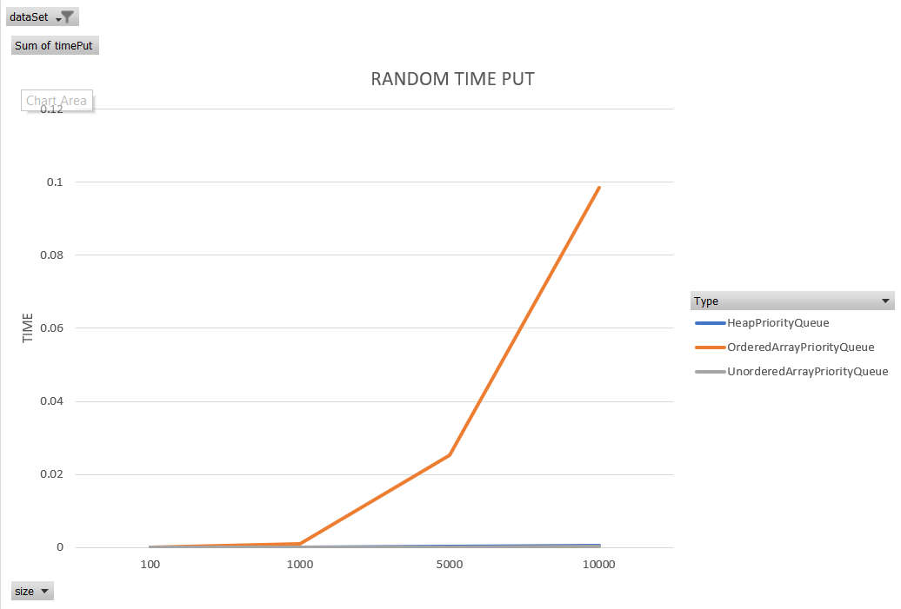
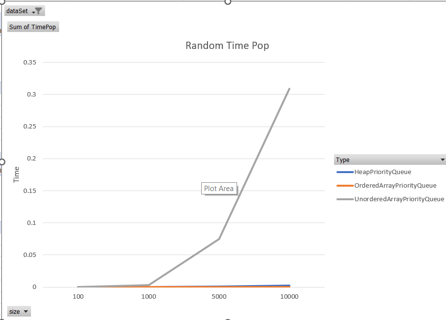
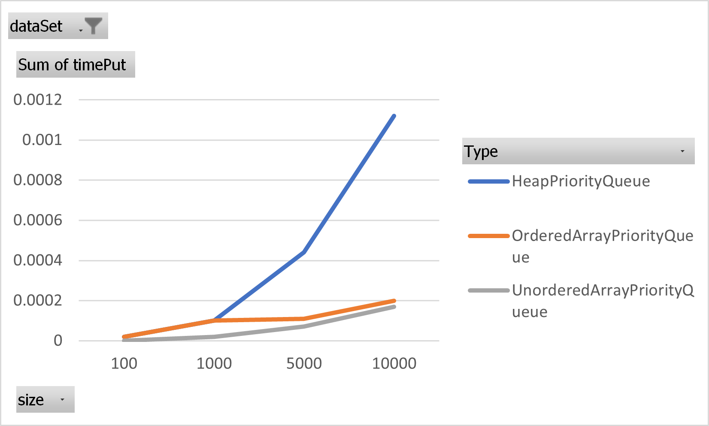
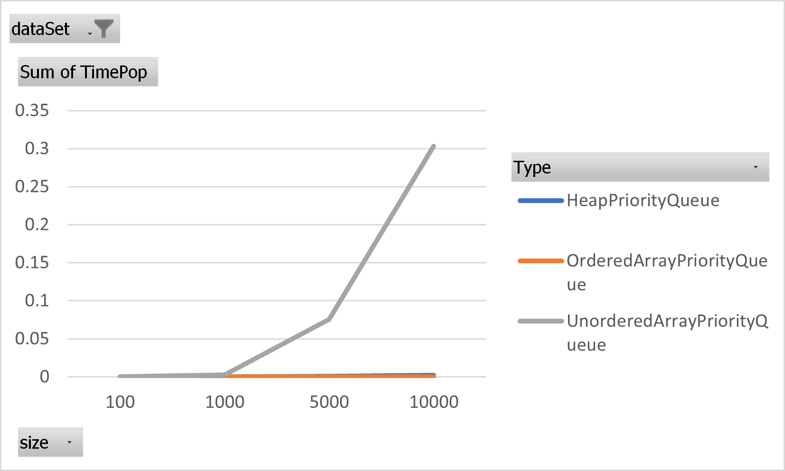
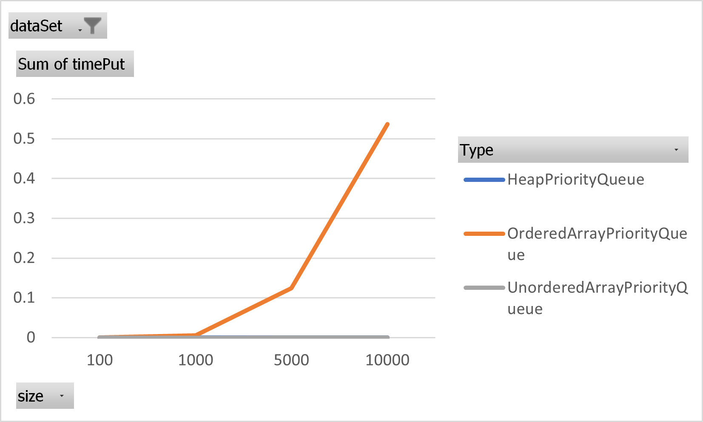
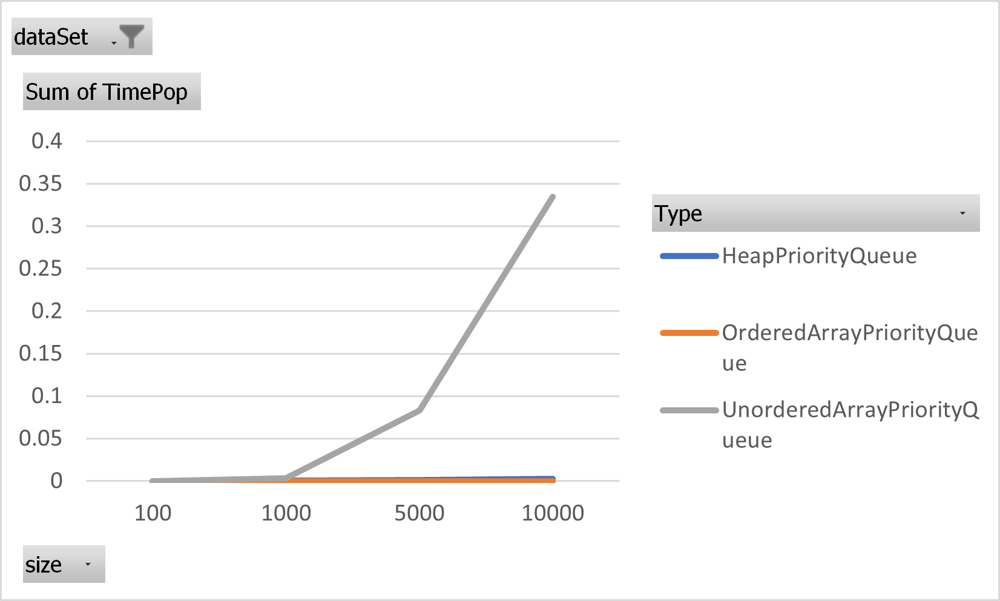

# Report TP5

## Table and Graph Random
### Time Put

| Size  | Heap     | Ordered  | Unordered |
|-------|----------|----------|-----------|
| 100   | 0.00005  | 0.00005  | 0.00001   |
| 1000  | 0.00012  | 0.00102  | 0.00003   | 
| 5000  | 0.00034  | 0.02534  | 0.00008   |
| 10000 | 0.00061  | 0.09851  | 0.00022   |

**Explanation:**

Using an algorithm to position data with random priority, it can be observed that the expected positioning times are met.
- Heap has a logarithmic time complexity (LogN).
- Ordered has linear time complexity (N).
- Unordered has constant time complexity.

### Time Pop

| Size  | Heap     | Ordered  | Unordered |
|-------|----------|----------|-----------|
| 100   | 0.00005  | 0        | 0.00009   |
| 1000  | 0.00022  | 0.00005  | 0.00305   |
| 5000  | 0.00114  | 0.00004  | 0.07491   |
| 10000 | 0.0024   | 0.0001   | 0.30933   |

**Explanation:**

Using an algorithm to position data with random priority, it can be observed that the expected popping times are met.
- Heap has logarithmic time complexity (LogN).
- Ordered has constant time complexity.
- Unordered has linear time complexity (N).

## Table and Graph Ascendant

### Time Put

| Size  | Heap     | Ordered  | Unordered |
|-------|----------|----------|-----------|
| 100   | 0.00002  | 0.00002  | 0         |
| 1000  | 0.0001   | 0.0001   | 0.00002   |
| 5000  | 0.00044  | 0.00011  | 0.00007   |
| 10000 | 0.00112  | 0.0002   | 0.00017   |

**Explanation:**

Using an algorithm to position data in ascending order, it can be observed that the expected positioning times are met.
- Heap has logarithmic time complexity (LogN).
- Ordered has constant time complexity.
- Unordered has constant time complexity.

*Why is Ordered expected to have constant time complexity?* Because in the implemented Ordered algorithm, a small optimization was made in the insertion algorithm, achieving constant insertion time for ordered input.

### Time Pop

| Size  | Heap     | Ordered  | Unordered |
|-------|----------|----------|-----------|
| 100   | 0.00001  | 0        | 0.00004   |
| 1000  | 0.00013  | 0.00001  | 0.00294   |
| 5000  | 0.0011   | 0.00007  | 0.07581   |
| 10000 | 0.00215  | 0.00011  | 0.30312   |

**Explanation:**

Using an algorithm to position data in ascending order, it can be observed that the expected popping times are met.
- Heap has logarithmic time complexity (LogN).
- Ordered has constant time complexity.
- Unordered has linear time complexity (N).

## Table and Graph Descendant

### Time Put

| Size  | Heap     | Ordered  | Unordered |
|-------|----------|----------|-----------|
| 100   | 0.00002  | 0.00006  | 0.00002   |
| 1000  | 0.00009  | 0.00508  | 0         |
| 5000  | 0.00008  | 0.12449  | 0.00011   |
| 10000 | 0.0002   | 0.53702  | 0.00024   |

**Explanation:**

Using an algorithm to position data in descending order (i.e., unordered), it can be observed that the expected positioning times are met.
- Heap has logarithmic time complexity (LogN).
- Ordered has linear time complexity (N).
- Unordered has constant time complexity.

### Time Pop

| Size  | Heap     | Ordered  | Unordered |
|-------|----------|----------|-----------|
| 100   | 0.00001  | 0        | 0.00003   |
| 1000  | 0.00014  | 0.00001  | 0.00347   |
| 5000  | 0.00108  | 0.00001  | 0.08323   |
| 10000 | 0.00247  | 0.00004  | 0.33494   |

**Explanation:**

Using an algorithm to position data in descending order, it can be observed that the expected popping times are met.
- Heap has logarithmic time complexity (LogN).
- Ordered has constant time complexity.
- Unordered has linear time complexity (N).

## Table: All Info

| Type      | Dataset   | Size  | Time Put             | Time Pop             |
|-----------|-----------|-------|----------------------|----------------------|
| Heap      | Random    | 100   | 5.0E-5               | 5.0E-5               |
| Heap      | Random    | 1000  | 1.2000000000000004E-4 | 2.2000000000000012E-4 |
| Heap      | Random    | 5000  | 3.4000000000000024E-4 | 0.0011400000000000008 |
| Heap      | Random    | 10000 | 6.100000000000005E-4 | 0.002400000000000002  |
| Heap      | Ascendant | 100   | 2.0E-5               | 1.0E-5               |
| Heap      | Ascendant | 1000  | 1.0000000000000002E-4 | 1.3000000000000004E-4 |
| Heap      | Ascendant | 5000  | 4.4000000000000034E-4 | 0.001100000000000001  |
| Heap      | Ascendant | 10000 | 0.0011200000000000008 | 0.0021500000000000017 |
| Heap      | Descendant| 100   | 2.0E-5               | 1.0E-5               |
| Heap      | Descendant| 1000  | 9.0E-5               | 1.4000000000000004E-4 |
| Heap      | Descendant| 5000  | 8.0E-5               | 0.0010800000000000009 |
| Heap      | Descendant| 10000 | 2.0000000000000012E-4 | 0.0024700000000000017 |
| Ordered   | Random    | 100   | 5.0E-5               | 0.0                  |
| Ordered   | Random    | 1000  | 0.0010200000000000007 | 5.0E-5               |
| Ordered   | Random    | 5000  | 0.025339999999999984  | 4.0E-5               |
| Ordered   | Random    | 10000 | 0.09851000000000003   | 1.0000000000000002E-4 |
| Ordered   | Ascendant | 100   | 2.0E-5               | 1.0E-5               |
| Ordered   | Ascendant | 1000  | 1.0000000000000002E-4 | 4.0E-5               |
| Ordered   | Ascendant | 5000  | 1.1000000000000003E-4 | 7.000000000000001E-5 |
| Ordered   | Ascendant | 10000 | 2.0000000000000006E-4 | 1.1000000000000003E-4 |
| Ordered   | Descendant| 100   | 6.0E-5               | 0.0                  |
| Ordered   | Descendant| 1000  | 0.005080000000000004  | 1.0E-5               |
| Ordered   | Descendant| 5000  | 0.12448999999999996   | 1.0E-5               |
| Ordered   | Descendant| 10000 | 0.5370199999999998    | 4.0E-5               |
| Unordered | Random    | 100   | 1.0E-5               | 9.0E-5               |
| Unordered | Random    | 1000  | 3.0E-5               | 0.0030500000000000024 |
| Unordered | Random    | 5000  | 8.0E-5               | 0.07491              |
| Unordered | Random    | 10000 | 2.200000000000001E-4  | 0.30933000000000005  |
| Unordered | Ascendant | 100   | 0.0                  | 4.0E-5               |
| Unordered | Ascendant | 1000  | 2.0E-5               | 0.002940000000000002 |
| Unordered | Ascendant | 5000  | 7.000000000000001E-5  | 0.07580999999999999  |
| Unordered | Ascendant | 10000 | 1.700000000000001E-4  | 0.3031200000000001   |
| Unordered | Descendant| 100   | 2.0E-5               | 3.0E-5               |
| Unordered | Descendant| 1000  | 0.0                  | 0.0034700000000000026 |
| Unordered | Descendant| 5000  | 1.0999999999999999E-4 | 0.08323000000000004  |
| Unordered | Descendant| 10000 | 2.4000000000000014E-4 | 0.33494              |
